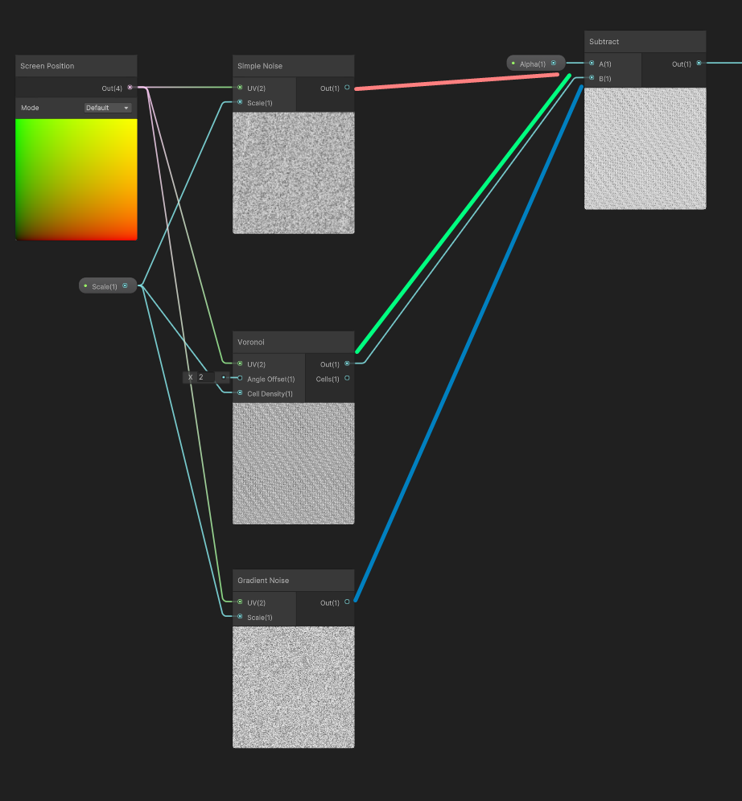

# DITHER ALPHA

This is a shader for doing dithered alpha, and using that technique to hide objects between the player and the camera (think of the old school isometric games).

The AlphaDither shader has 3 parameters:
* Scale: Noise scale, the larger, the noisier the dithering will be
* Color: The color of the object - this is mainly for testing
* Alpha: The alpha of the object - this is mainly for testing you want to hook this up in the shader to the color or the alpha channel of a texture

There are 3 types of noise in the shader, I'm using Voronoi because I like the aesthetic result of it, but you just need to do the blue, green or red connection on the shader.

Also, the noise is using the screen position as an input, which might look weird if the camera moves around a lot and the noise scale is low, in that case you might prefer to use the world/local position of the object as noise source, for that you just have to replace the blue output by the purple output.

There's also a test shader for object occlusion, just set that to any object that might occlude the "player"; it can be configured in mostly the same way as the alpha dither shader (noise type and screen space/world position).
It has 3 parameters: 
* Scale: Noise scale, the larger, the noisier the dithering will be
* CameraRange: Camera distance for the effect: X defines where the occlusion effect starts (less than this is at full force), and Y where the occlusion effect ends (larger than this is fully opaque and doesn't hide anythin)
* WindowRange: Defines which are of the window is affected by the effect (start/end), in angular cosine units.

# Licenses

* All source code by Diogo Andrade is licensed under the [MIT] license.

# Metadata

* Autor: [Diogo Andrade]

[Diogo Andrade]:https://github.com/DiogoDeAndrade
[MIT]:LICENSE
